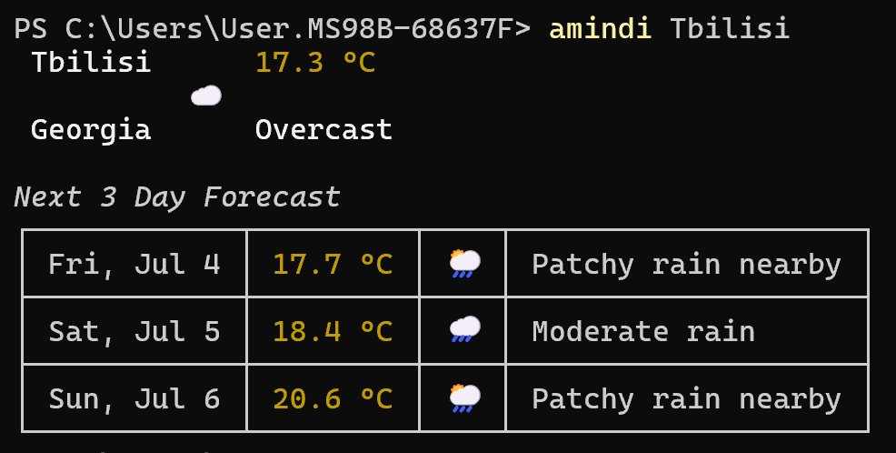

# Amindi ⛅

> Command-line weather forecast tool with clean output formatting

Get accurate weather forecasts directly in your terminal. Supports location search, unit conversion, and multi-day forecasts.

## Features

- Current weather conditions  
- Forecasts for up to 7 days  
- Celsius and Fahrenheit temperature support  
- Clean, readable terminal output  

## Installation

### Prerequisites
- Go 1.24+ ([installation guide](https://go.dev/doc/install))

### Option 1: Install via Go:
```bash
go install github.com/georgedolee/amindi@latest
```

### Option 2: Build from source:

```bash
git clone git@github.com:georgedolee/amindi.git
cd amindi
go build
```

## Environment Configuration

`amindi` comes with an embedded API key for immediate use, but please note:
- This key has strict rate limits (1,000 calls/day shared across all users)
- For personal use, get your own free key at [WeatherAPI.com](https://www.weatherapi.com/)
- Set the `AMINDI_API_KEY` environment variable to your personal key

> **Important**: The embedded key is for evaluation only. Heavy usage may cause rate limiting for all users.
Then,  so `amindi` can access it.

## Usage

```bash
amindi [location] [flags]
```
### Flags:

| Flag            | Description                    | Default  | Values                  |
|-----------------|--------------------------------|----------|-------------------------|
| `-u`, `--unit`  | Temperature unit               | celsius  | celsius, fahrenheit     |
| `-d`, `--days`  | Forecast days                  | 3        | 1-7                     |

### Examples:

```shell
amindi Tbilisi
```
```shell
amindi London --unit fahrenheit
```
```shell
amindi "New York" -d 7 -u fahrenheit
```

### Example Output

Example output showing formatted weather



## Dependencies

- [cobra](https://github.com/spf13/cobra) – CLI framework
- [go-pretty](https://github.com/jedib0t/go-pretty) – Table formatting
- [fatih/color](https://github.com/fatih/color) – Terminal color output
- [godotenv](https://github.com/joho/godotenv) – Environment variable management

## License

This project is licensed under the [MIT License](./LICENSE).
